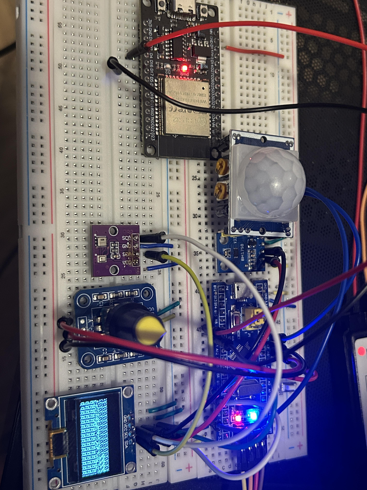
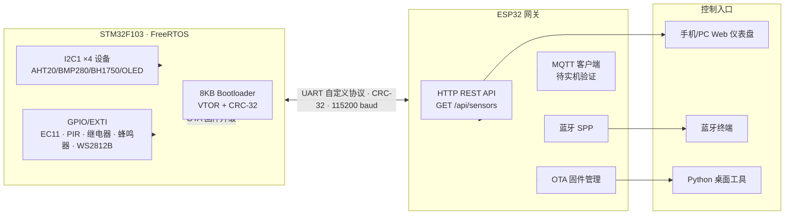
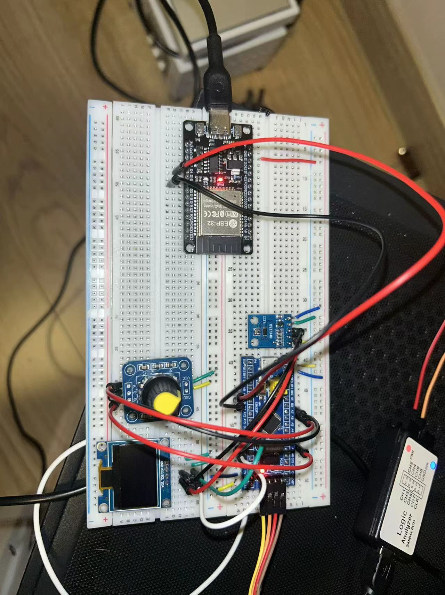

<div align="center">

# STM32 Smart-Home OTA System
### 智能环境监测与联动控制系统

**STM32F103 + FreeRTOS + ESP32**｜自定义 Bootloader｜Wi-Fi / Bluetooth OTA｜实机软硬件联调

一个面向 MCU/RTOS 嵌入式研发岗位的智能硬件项目：STM32 负责实时采集与控制，ESP32 负责无线网关和本地 Web 控制，二者通过自定义 UART 协议协作。

[](https://github.com/finnyoun9/stm32-smart-home-ota/actions/workflows/firmware.yml)




<sub>面包板开发阶段实拍 · 非最终装配状态 · 最终整机实物图待补</sub>

</div>

> **Repository rename (2026-08-17):** `bluepill-ota-bootloader` → `stm32-smart-home-ota`。旧名称只强调 Bootloader；新名称准确反映系统包含 FreeRTOS、传感器/执行器、ESP32 网关和 OTA。旧 GitHub 链接会自动重定向。

## 导航

[为什么做这个项目](#为什么做这个项目--why-this-project) · [当前进度](#当前进度--status) · [系统架构](#系统架构--system-architecture) · [技术栈](#技术栈) · [硬件实物](#硬件实物--hardware-photos) · [快速开始](#快速开始) · [最大的难点](#项目最大的难点--biggest-technical-challenge) · [AI 辅助开发](#ai-辅助开发--ai-assisted-development) · [面试怎么讲](#面试怎么讲这个项目--how-to-talk-about-this-in-interviews) · [文档索引](#文档索引)

## 为什么做这个项目 / Why this project

之前做的是 Web/后端方向（Node/TS），这个项目是转向 STM32/MCU 嵌入式方向求职时刻意设计的能力证明项目——按招聘 JD 里高频出现的能力反推范围：从零写 Bootloader、FreeRTOS 多任务划分、无线网关（ESP32）、自定义通信协议 + 真实硬件 OTA、多传感器/执行器集成、软硬件联调排障，而不是抄一个现成教程跑起来。完整的项目组合规划见 [docs/resume-roadmap.md](docs/resume-roadmap.md)：另有一块 STM32F407VET6 最小系统板项目补原理图/PCB/焊接/Bring-up 这条硬件设计链路，两者合起来覆盖“固件系统集成”和“硬件设计到实物验证”两条能力线。

## 当前进度 / Status

| 子系统 | 状态 | 证据边界 |
| --- | --- | --- |
| 8 KB 自定义 Bootloader + VTOR 重定位 + CRC-32 | **已真机验证** | Application 从 `0x08002000` 正确回跳运行 |
| 蓝牙 / 手机 Web OTA 双入口 | **已真机验证** | `tools/ota_regression.py` 自动化回归：蓝牙路径 `VERSION=3` PASS，Web 路径 `VERSION=4` PASS |
| FreeRTOS 4 任务架构（通信/控制/应用/监控） | **已真机验证** | 已移除独立状态灯任务（PC13 心跳），逻辑并入现有任务 |
| 多传感器（AHT20/BMP280/BH1750/SSD1306/HC-SR501） | **已真机验证** | I2C1 共 4 地址稳定工作，OLED 菜单可操作 |
| 双路继电器 + 有源蜂鸣器 | **已真机验证** | PA2/PA3/PB1，蓝牙与 Web 均可控制 |
| WS2812B 自动调光 | **已真机验证** | 逻辑分析仪 DOUT 证据，见[最大的难点](#项目最大的难点--biggest-technical-challenge) |
| ESP32 Web 仪表盘 + `GET /api/sensors` | **已真机验证** | 1 秒刷新，18B 定点快照 |
| Firmware CI（GitHub Actions） | **已跑通** | 三端固件构建 + 协议烟测自动执行 |
| MQTT（公共 EMQX 沙盒 broker） | **代码完成，待实机验证** | 编译通过，尚未接实机确认收发 |
| ST7789 TFT 新版菜单/中英文切换 | **待实机验证** | 构建通过，未完成完整回归 |

完整的已验证/待验证记录见 [CHANGELOG.md](CHANGELOG.md)，求职版本收口计划见 [docs/resume-roadmap.md](docs/resume-roadmap.md)。`WebSocket` 和部分规划传感器（MPU6050/VL53L0X/DHT11/MQ-2/HC-SR04）仍是目标架构，**不作为已完成能力**。


## 系统架构 / System architecture



## 技术栈

### STM32 (C, FreeRTOS)

- **Bootloader**: 8KB 裸机，Flash 分区管理，`.ramfunc` RAM 执行，CRC-32 校验，OTA 状态机
- **FreeRTOS**: 当前 4 任务架构（Comm/Control/App/Monitor）；`AppTask` 整合本地传感器采集、PIR 状态和 OLED 菜单
- **当前外设**:
  - I2C1 100kHz 多设备总线：SSD1306、BH1750、AHT20、BMP280
  - GPIO/EXTI：EC11 四状态解码、独立确认按键、HC-SR501 输入
  - GPIO 输出：PA2/PA3 两路低电平触发继电器、PB1 低电平触发蜂鸣器、PB5 WS2812B 位操作输出
- **后续规划协议**:
  - I2C2（MPU6050、VL53L0X）
  - UART（双串口：ESP32 协议 + 调试日志）
  - 1-Wire（DHT11 bit-banging）
  - Timer Encoder Mode（旋转编码器硬件正交解码）
  - Timer Input Capture（HC-SR04 超声波测距）
  - PWM 50Hz（SG90 舵机角度控制）
  - ADC（MQ-2 烟雾浓度采集）
  - GPIO 外部中断（PIR 人体检测 + 对射红外门窗检测）

### ESP32 (C++, ESP-IDF)

- 蓝牙 Classic SPP 服务器（手机直连控制）
- WiFi SoftAP + 手机 Web OTA（已实机验证）
- STM32 传感器快照轮询 + `GET /api/sensors` 实时缓存接口（实机通过）
- WiFi HTTP Client（远程 OTA 固件下载）
- SPIFFS 固件缓存 + Application 向量表/CRC 校验
- MQTT 客户端（公共 EMQX 沙盒 broker，代码已合入，待实机验证）
- WebSocket（后续规划）

### 控制接口

- **手机 Web OTA**: ESP32 内置响应式页面，iPhone 可直接上传 `.bin`
- **Web 仪表盘**: ESP32 内置纯 HTML/CSS/JS SPA，实时状态已接入；写控制与历史曲线待扩展
- **蓝牙终端**: Windows/Android Classic SPP 文本命令（iPhone 不支持 SPP）
- **Python 桌面**: `ota_sender.py` 固件上传 + `control_panel.py` 控制面板 + `ota_regression.py` 自动化 OTA 回归

## 传感器进度

| 模块 | 当前接口 | 功能 | 地址/引脚 | 状态 |
|------|----------|------|-----------|------|
| AHT20 + BMP280 组合板 | I2C1 | 温度、湿度、气压 | 0x38 + 0x76/0x77 | 实机通过 |
| BH1750 | I2C1 | 光照度 | 0x23 | 实机通过 |
| SSD1306 OLED | I2C1 | 常驻环境与执行器状态 | 0x3C | 实机通过 |
| GMT020-02 TFT | SPI2 | 240×320 彩色菜单与控制页 | ST7789V | 新版 UI 待实机验证 |
| 15× WS2812B | GPIO bit-bang | BH1750 反向联动白光照明 | PB5 | 实机通过（DOUT 验证） |
| HC-SR501 | GPIO | 人体红外 | PB0 | 实机通过 |
| EC11 + 返回键 | GPIO EXTI + GPIO | 旋转选择、PA1 确认、PA4 返回 | PA6/PA7 + PA1/PA4 | 返回键待接线验证 |
| MPU6050 | I2C2（规划） | 6轴姿态 | 0x68 | 待接入 |
| VL53L0X | I2C2（规划） | 激光测距 | 0x29 | 待接入 |
| DHT11 | 1-Wire（规划） | 温湿度冗余 | - | 待接入 |
| MQ-2 | ADC（规划） | 烟雾浓度 | - | 待接入 |
| HC-SR04 | Timer IC（规划） | 超声波测距 | - | 待接入 |

## 规划执行器清单

| 模块 | 控制方式 | 联动场景 | 状态 |
|------|---------|---------|------|
| 2路继电器 | GPIO OUT | 继电器2=灯带（NO2 通断 VCC）；继电器1暂未使用 | 实机通过 |
| 超声波雾化片 | GPIO OUT | 暂停接入 | 驱动板已损坏，待更换 |
| SG90 舵机 | PWM 50Hz | 百叶窗/阀门角度 | 待接入 |
| 有源蜂鸣器 | GPIO OUT | 手动控制；烟雾/高温联动待接入 | 实机通过 |

## Flash 内存布局

| 区域 | 地址 | 大小 | 说明 |
|------|------|------|------|
| Bootloader | 0x08000000 | 8KB | OTA 状态机 + Flash 编程 |
| Application | 0x08002000 | 54KB | FreeRTOS + 传感器 + 控制 |
| Config | 0x0800F800 | 2KB | OTA 状态 + 固件版本 |

## 硬件接线

完整引脚分配和面包板接线图见 [docs/project-framework.md](docs/project-framework.md)

```
STM32 Blue Pill          ESP32              传感器/执行器
─────────────────        ────────────        ────────────
PA9 (TX)  ────────────► GPIO16 (RX)
PA10 (RX) ◄──────────── GPIO17 (TX)
GND       ─────────────── GND

PB6/PB7  (I2C1 SCL/SDA) ─── AHT20+BMP280 + BH1750 + SSD1306
PB13/PB15 (SPI2 SCK/MOSI) ── GMT020-02 SCL/SDA
PB12/PB14/PA8 (GPIO OUT) ─── GMT020-02 CS/DC/RST
PB5      (GPIO bit-bang) ───── WS2812B DIN
PA6/PA7  (GPIO EXTI) ─────── EC11 A/B
PA1      (GPIO IN) ───────── EC11 确认按键
PB0      (GPIO IN) ───────── HC-SR501 PIR
PB10/PB11 (I2C2，规划) ───── MPU6050 + VL53L0X
PA2      (GPIO OUT) ──────── 继电器1（暂未使用，低电平触发）
PA3      (GPIO OUT) ──────── 继电器2（NO2 接灯带 VCC，低电平触发）
PB1      (GPIO OUT) ──────── 有源蜂鸣器（低电平触发）
PA0      (TIM2_CH1) ──────── SG90 舵机
PA5      (ADC) ───────────── MQ-2 烟雾 (经1k/2k分压)
```

### 硬件实物 / Hardware photos

<details>
<summary><strong>展开面包板开发过程实拍</strong></summary>

| 早期搭建（ESP32 + STM32 + EC11 + BH1750 + OLED） | 早期搭建（含 PIR + 逻辑分析仪接线） |
| --- | --- |
|  |  |

| 整体接线（含 ST7789 TFT） | OLED 中文乱码修复前后对比 |
| --- | --- |
|  |  |

以上均为开发过程中的接线状态，**不是最终成品**；最终装配完成后的整机实物图会补充到这里。完整说明见 [docs/photos/README.md](docs/photos/README.md)。

</details>

## 快速开始

### 工具链

```bash
pip install pyserial        # Python 工具
pio --version               # PlatformIO（编译 STM32 两端 + ESP32）
```

### 构建

```bash
pio run -e bluepill                # Bootloader → .pio/build/bluepill/firmware.bin
pio run -e app                     # Application → .pio/build/app/firmware.bin
pio run -d esp32-comm-bridge       # ESP32 桥 → esp32-comm-bridge/.pio/build/esp32dev/firmware.bin
```

### 烧录

1. **Bootloader**: ST-Link 执行 `pio run -e bluepill -t upload`，写入 `0x08000000`
2. **Application**: ST-Link 执行 `pio run -e app -t upload`，写入 `0x08002000`
3. **ESP32**: 手动进入下载模式后执行 `pio run -d esp32-comm-bridge -t upload --upload-port COM4`

### 测试

```bash
# Windows 蓝牙 SPP 出站端口（本机当前为 COM6）
pio device monitor -p COM6 -b 115200

# 在 monitor 中输入 STATUS 或 VERSION 并按 Enter

# 自动化 OTA 回归（蓝牙 + Web 两条路径，含版本回读校验）
py -3.11 tools/ota_regression.py bluetooth --port COM6
py -3.11 tools/ota_regression.py web --base-url http://192.168.4.1 --verify-port COM6

# 手机 Web OTA：连接 ESP32 热点后访问
# SSID: STM32-OTA-Bridge / Password: stm32ota
浏览器打开 http://192.168.4.1

# 查看 STM32 实时传感器与执行器快照
curl.exe http://192.168.4.1/api/sensors
```

<details>
<summary><strong>展开手机 Web OTA 完整流程</strong></summary>

1. 手机连接 ESP32 热点 `STM32-OTA-Bridge`，密码 `stm32ota`
2. Safari/浏览器打开 `http://192.168.4.1`
3. 选择 STM32 Application 的 `firmware.bin`，填写大于 0 的目标版本
4. 点击“开始 OTA 升级”，等待页面显示“升级成功”

首页每 1 秒读取 `GET /api/sensors`，显示温湿度、气压、光照、PIR、两路继电器、蜂鸣器、自动模式和灯带亮度。ESP32 每 1 秒通过 UART 查询一次 STM32 的 18B 定点快照，缓存超过 5 秒未更新时页面显示数据超时。完整实现见 [docs/web-realtime-dashboard.md](docs/web-realtime-dashboard.md)。

OTA 页通过 `POST /api/upload?version=<N>` 上传固件，ESP32 检查 54KB 大小上限、CRC-32、Cortex-M 初始栈和 Application Reset Vector；校验通过后由 `POST /api/start` 启动 UART OTA。`GET /api/status` 返回上传和写入进度。

> Web OTA 只接受链接到 `0x08002000` 的 STM32 Application 镜像。Bootloader 或其他目标生成的 `.bin` 会被向量表检查拒绝。

</details>

<details>
<summary><strong>展开蓝牙命令参考</strong></summary>

连接 ESP32 蓝牙 SPP 服务 `STM32-OTA-Bridge`（手机用 "Serial Bluetooth Terminal"）：

| 命令 | 说明 |
|------|------|
| `STATUS` | 桥状态：BT/WiFi 连接、固件暂存情况 |
| `VERSION` | 查询 STM32 当前固件版本 |
| `OTA <url>` | 从 URL 下载固件并触发 OTA（版本从文件名 `fw_v<N>.bin` 解析） |
| `FW <ver>,<size>,<crc32>` | 开始蓝牙推送固件；声明精确长度、版本和标准 CRC-32 |
| `DATA <offset>,<base64>` | 写入一块 Base64 固件数据；ESP32 用下一偏移量 ACK（通常由脚本自动发送） |
| `VERIFY` | 校验暂存文件长度和 CRC-32（通常由脚本自动发送） |
| `SEND` | 在桥返回 `FW: staged` 后，把已校验的暂存固件传输到 STM32 |
| `WIFI <ssid>,<pass>` | 配置 WiFi 并重连（存 NVS，重启后仍生效） |
| `RESET` | 软件复位 ESP32 |
| `RELAY1 ON/OFF` | 控制继电器1（当前未接负载） |
| `RELAY2 ON/OFF` | 控制继电器2（NO2 上的灯带 VCC 通断） |
| `RELAY` | 查询两路继电器状态与自动模式 |
| `AUTO ON/OFF` | 加湿器移除期间保持关闭；命令保留兼容性 |
| `MANUAL` | 关闭自动联动（等价 `AUTO OFF`） |
| `BUZZER ON/OFF` | 控制 PB1 低电平触发的有源蜂鸣器 |

> Web 控制页已接入 `POST /api/control`。当前可控制灯带电源（Relay 2 / NO2）和蜂鸣器；灯带亮度仍由 BH1750 自动映射，网页亮度滑块暂未启用。
>
> 雾化驱动板曾在未连接雾化片时直接上电并损坏，加湿器现已从固件自动联动和 Web 控制中移除。更换模块后必须先按新模块说明接好雾化片与水位条件，再给驱动板上电。
>
> `tools/bridge_ota.py` 会自动计算 `<size>` 和 CRC，把固件编码为带偏移量 ACK 的 Base64 分块，执行 `VERIFY` 后再发送 `SEND`。不要在普通串口终端里手工粘贴二进制 `.bin`。

</details>

## 项目最大的难点 / Biggest technical challenge

**主线难点：WS2812B 灯带联调。** 最初用 SPI1 4MHz + 5-bit 编码产生 WS2812B 时序，逻辑分析仪在 `DIN` 端测得的波形（脉宽、bit 数）看起来完全正常，但灯带没有任何反应。如果只信发送端“看起来对”，这个 bug 会一直定位不到——真正的判据是链路下一级的证据：把探头搭在第一颗灯珠的 `DOUT` 上，发现根本没有转发信号，说明灯珠没能正确解码 SPI 产生的那种时序（SPI 时钟域和 WS2812B 单总线时序协议在边界条件上不匹配）。换成在 64MHz 主频下用 GPIO bit-bang 手写时序后，`DOUT` 才捕获到后 14 颗共 336 bit、42 字节的有效转发帧，链路才算真正闭环。这次教训之后固化成排障习惯：不信“发送端看起来对”，只认“接收端/下一级看得到”的证据——README 和 CHANGELOG.md 里“已验证 / 规划中”的证据边界规则，本质上是从这里延伸出来的。对照证据保留在 [docs/captures/](docs/captures/README.md)：`spi-din-not-accepted.vcd`（旧方案 DIN 输入）与 `bitbang-dout-confirmed.vcd`（最终方案 DOUT 输出）。

**次要难点（更适合聊架构取舍）：** STM32F103 只有 64KB 单 Bank Flash，Bootloader 占 8KB、Application 占 54KB，没有预留 A/B 分区空间，导致 OTA 传输中途掉电会让旧固件立即失效（Bootloader 收到第一个 chunk 就擦除含中断向量表的第 0 页，详见下方“已知限制”）。这是芯片选型和 Flash 预算下的真实取舍，面试时可以直接讲清楚是资源约束下的工程决策，而不是回避这个问题。

## AI 辅助开发 / AI-assisted development

这个项目从头到尾用 Claude Code / Codex 做协作开发，边界写清楚，不夸大也不藏着：

- **代码生成与重构**：STM32 驱动骨架、UART 自定义协议解析、ESP32 端 REST API 和 Web 仪表盘前端（HTML/CSS/JS）等大量初稿由 AI 生成，我负责改成符合实际引脚/时序的版本并上机验证。
- **调试辅助**：把逻辑分析仪波形描述、串口日志、错误现象喂给 AI，让它列可能原因（比如 WS2812B 第一颗灯珠 `DOUT` 无输出的几种可能、CRC 查表里 4 个错误常量怎么定位），我按假设逐条上机排除——AI 帮助收窄范围，不负责下最终结论。
- **工程文档与项目管理**：[docs/agent-handoff.md](docs/agent-handoff.md)、[docs/resume-roadmap.md](docs/resume-roadmap.md)、[CHANGELOG.md](CHANGELOG.md) 里“已验证/规划中”的证据分离规则，由 AI 主导编写和持续维护，相当于把 AI 当一个常驻的技术项目经理，负责记基线、列 P0、复盘验收标准，我做审核和最终决策。
- **不变的部分**：所有硬件接线、上电、示波器/逻辑分析仪实测、每一条“实机通过”结论，都是我自己在实物上完成和验证的。AI 不替你判断真实硬件行为——这也是这个仓库坚持把“AI 生成/建议”和“实机验证”分得很清楚的原因。

## 面试怎么讲这个项目 / How to talk about this in interviews

**30 秒版本**：一个 STM32F103 + FreeRTOS + ESP32 的智能家居终端，自己写了 Bootloader 和 OTA 协议，支持蓝牙和手机 Web 两种升级入口，做了多传感器采集和继电器/灯光联动，用逻辑分析仪定位过一个 WS2812B 时序 bug。开发过程中大量用 AI 做代码生成和调试辅助，但硬件接线、实机验证和最终工程判断都是自己做的。

**大概率会被追问的问题（如实回答）：**

| 追问 | 回答 |
|------|------|
| OTA 中途掉电会怎样？ | 会失效，需要重新 OTA 或用 ST-Link 重刷；原因是 64KB 单 Bank Flash 没有 A/B 分区预算，是资源约束下的真实取舍，生产方案会先写暂存区再原子切换。 |
| UART 收发用了 DMA 吗？ | 目前是 RXNE 中断 + StreamBuffer，还没上 DMA + IDLE，这是当前实现，不是设计上限。 |
| AI 帮你写了多少代码？ | 驱动骨架、协议解析、Web 前端等大量初稿由 AI 生成，但时序校准、引脚分配、实机排障和最终验证是自己做的（详见上面“AI 辅助开发”）。 |
| 为什么用 GPIO bit-bang 而不是 SPI/DMA 产生 WS2812B 时序？ | SPI 编码在 `DOUT` 端验证不通过（见“项目最大的难点”），bit-bang 是实测有效的方案。 |
| MQTT 真的能用吗？ | 代码编译通过、逻辑和 REST API 共用同一套 JSON 序列化，但还没接实机验证收发，如实说“待验证”，不说“已完成”。 |

**准备好的调试故事**（对应 [docs/build-notes.md](docs/build-notes.md) 和 [CHANGELOG.md](CHANGELOG.md)）：

1. WS2812B `DIN` 有波形但 `DOUT` 不转发——SPI 编码时序不匹配，换 GPIO bit-bang 解决。
2. 协议 CRC-32 查表中 4 个错误常量——`123456789` 经典测试向量没触发，靠全字节 `0x00..0xFF` 向量补回归。
3. 继电器/灯带供电链路问题——雾化驱动板未接负载直接上电烧毁，之后所有执行器接入前先确认负载再上电。
4. Bootloader 与 HC-SR501 抢占 `PB0` 导致每次上电卡在维护模式——移除 Bootloader 对 `PB0` 的读取，PIR 专用该引脚，OTA 入口改用配置标志和 200ms UART 窗口。

<details>
<summary><strong>展开目录结构</strong></summary>

```
stm32-smart-home-ota/
├── shared/                  # 共享协议 (CRC-32/帧解析/配置)
├── bootloader/              # 8KB 自定义 Bootloader
├── application/             # STM32 FreeRTOS 应用
├── esp32-comm-bridge/       # ESP32 通信网关
├── tools/                   # Python PC 工具（含自动化 OTA 回归）
└── docs/                    # 架构 + 接线 + API + 照片 + 抓包证据
```

完整说明见 [docs/project-framework.md](docs/project-framework.md)

</details>

<details>
<summary><strong>展开开发日志（按时间）</strong></summary>

### 本地验证记录（2026-08-07）

- Bootloader 已通过 PlatformIO + `ststm32` 平台编译验证：RAM 11.0% (2252B)，Flash 8.8% (5756B)，`firmware.bin` 约 6KB（满足 bootloader 8KB 硬约束）
- 修复：`shared/protocol.h` 中 `BootConfig_t` 大小断言 56 → 48（实际 12×uint32=48B）；`FLASH_BASE`/`FLASH_PAGE_SIZE` 加 `#ifndef` 保护避免与 STM32 HAL 重定义
- PC 端工具：`python tools/ota_sender.py COM3 fw.bin --version 2`（Windows 串口用 COM 格式）
- 注意：ESP32 端编译需 PlatformIO 能访问官方包镜像（国内网络建议配置镜像源）

### 本地验证记录（2026-08-08）

**三端固件全部编译通过**（PlatformIO + ststm32 / espressif32）：

| 固件 | RAM | Flash | 产物 |
|------|-----|-------|------|
| Bootloader | 11.0% (2252B) | 8.8% (5756B) | `.pio/build/bluepill/firmware.bin` |
| Application | 87.4% (17900B) | 50.6% (33192B) | `.pio/build/app/firmware.bin` |
| ESP32 Bridge | 19.9% (65184B) | 74.8% (1372089B / 1835008B) | `esp32-comm-bridge/.pio/build/esp32dev/firmware.bin` |

关键结论（细节见 [docs/build-notes.md](docs/build-notes.md)）：
- **ESP-IDF 6 API 迁移**：`esp_spp_init`→`esp_spp_enhanced_init(&cfg)`；`esp_bt_dev_set_device_name`→`esp_bt_gap_set_device_name`；`esp_wifi_is_connected`→`esp_wifi_sta_get_ap_info()`
- **ESP32 实机是 4MB Flash**：2026-08-12 由 `esptool flash_id` 读取 JEDEC `c4:6016` 确认；factory 保持 1.75MB，storage(SPIFFS) 扩至 2.19MB
- **灯带控制**：TFT 与 Web 共用 STM32 状态，均支持继电器 2 / NO2 电源开关、AUTO/MANUAL 模式和手动亮度（1–100%）。AUTO 仍按 BH1750 的 5–1000 lux 映射。
- **TFT 中英文**：系统页按下旋钮，或 Web 系统页切换。中文使用精简 16×16 点阵子集；设置当前仅在本次上电有效，避免为 UI 偏好频繁擦写单 Bank Flash。
- **蓝牙组件用 sdkconfig.defaults 开启**（`-D CONFIG_BT_*` 编译宏对 ESP-IDF 无效）
- **共享协议跨平台**：`shared/protocol.c` 已 C/C++ 兼容；ESP32 端镜像为 `src/protocol.cpp` 编译
- **国内网络编译 ESP32 需代理**：`$env:HTTPS_PROXY='http://127.0.0.1:7897'; pio run -d esp32-comm-bridge`
- Application 使用 8MHz HSE→PLL×8 的 64MHz 时钟；当时初次联调使用 9600 baud，当前 STM32↔ESP32 链路已统一为 115200 baud

### 硬件 OTA 闭环验证（2026-08-09）

- ESP32（CH340，COM4）和 STM32（ST-Link SWD）均已完成烧录并通过写后校验。
- 物理 UART：`ESP32 GPIO17 → PA10`、`ESP32 GPIO16 ← PA9`、两板 GND 直连；使用 USART1，9600 baud。
- Windows 已通过 Bluetooth Classic SPP 的 COM6 连接 `STM32-OTA-Bridge`；基础链路连续发送 10 次 `VERSION`，10/10 成功。
- 使用 `tools/bridge_ota.py` 暂存并发送 15,956 字节 Application 镜像，CRC-32 为 `0x3B274D7E`；ESP32 返回 `STATUS: OTA complete!`。
- OTA 后再次发送 `VERSION`，STM32 返回 `FW Version: 1`。这次已经覆盖 PC→蓝牙 SPP→ESP32 SPIFFS→STM32 Bootloader→Flash/CRC→Application 回跳的完整闭环。
- 排查中发现两份 CRC 查表各有 4 个错误常量；`123456789` 经典向量恰好没有触发。现在额外用 `0x00..0xFF` 全字节向量（期望 `0x29058C73`）做回归，避免同类问题被单一测试向量漏掉。
- iPhone 已连接 ESP32 SoftAP 并打开内置 Web OTA 页面；手机上传 15,956 字节 Application 镜像、目标版本设为 2，升级后通过 COM6 查询返回 `FW Version: 2`。该路径不需要 PC、ST-Link 或 ESP32 USB 参与固件发送。

### 本地环境终端验证（2026-08-10）

- I2C1 `PB6/PB7 @ 100kHz` 同时挂载 SSD1306、BH1750 和 AHT20+BMP280 组合板，四个地址均已在实机稳定工作。
- OLED 菜单支持旋转选择、按键确认和返回；页面包括环境、光照、人体感应、系统状态与项目信息。
- AHT20/BMP280 已显示温度、相对湿度和气压；湿度使用定点数并显示为 `61.0% RH`，未引入软件浮点。
- HC-SR501 支持 30 秒预热状态和 HIGH/LOW 检测；BH1750 光照值可周期刷新。
- Application 构建占用：RAM 17,676 B（86.3%），Flash 25,200 B（38.5%）；后续扩展需优先关注 RAM 余量。

### 执行器与 WS2812B 联调验证（2026-08-11）

- 两路低电平触发继电器已改到 `PA2/PA3`，有源蜂鸣器接 `PB1`；供电、共地、手动命令和继电器触点动作均已实机确认。
- WS2812B 使用 DP100 5V 经 1N4001 降到约 4.2V，数据线为 `PB5 → DIN`，灯带与 STM32 共地。入口串联 220~470Ω 数据电阻仍建议保留，但本次故障并不是缺少该电阻。
- 原 SPI1 4MHz/5-bit 编码在 `DIN` 上测得的脉宽和数据都合理，但第一颗灯珠 `DOUT` 没有转发，灯带实际未接收。换回 64MHz 下经过实机验证的 GPIO bit-bang 后，第一颗 `DOUT` 捕获到后 14 颗共 336 bit、42 字节的有效帧，才算真正闭环。
- 最终逻辑：BH1750 每 200ms 更新目标亮度，`≤5 lux → 160/255`、`≥1000 lux → 1/255`，中间反向线性映射；每次最多变化 16 级，2 级以内视为传感器抖动，且仅亮度确实变化时发送灯带帧。
- 当前 Application 构建占用：RAM 17,900 B（87.4%），Flash 33,192 B（50.6%）。OLED 已改为常驻状态屏，TFT 使用无帧缓冲的局部刷新菜单。完整波形证据和排障结论见 [docs/build-notes.md](docs/build-notes.md)。

### 自动化 OTA 回归与 PC13 心跳移除（2026-08-23 / 2026-08-24）

- 新增 `tools/ota_regression.py`：自动完成固件基线记录、蓝牙/Web 两条 OTA 路径的发送与版本回读校验，结果写入 [docs/ota-regression-final.md](docs/ota-regression-final.md)。蓝牙路径 `VERSION=3` PASS，Web 路径 `VERSION=4` PASS。
- 移除独立的状态灯心跳任务（`PC13`），FreeRTOS 从 5 任务简化为 4 任务，不再单独占用一个任务栈做心跳指示。
- 新增 GitHub Actions `Firmware CI`：三端固件构建 + 共享协议烟测自动跑绿。

</details>

## 关键约束

- STM32F103 单 Flash Bank → Flash 编程代码在 RAM 中执行 (`.ramfunc`)
- Flash 页大小: 1KB → OTA 以 1KB 块传输
- Bootloader 固定 8KB → 不能超出
- Application 起始于 `0x08002000` → 必须设置 `SCB->VTOR`

### 已知限制：OTA 传输中途掉电无回退

Bootloader 收到第一个 chunk 就会擦除 Application 区第 0 页（含中断向量表），所以 OTA 传输中途掉电会让旧固件立即失效：下次上电 `app_is_valid()` 判定应用无效，设备停在 Bootloader 的 maintenance 模式，需要重新完成一次 OTA 或用 ST-Link 重刷才能恢复。这是 64KB 单 Bank Flash、没有预留 A/B 分区空间的直接结果——生产级方案通常会先写暂存区、整体校验后再原子切换，但在 8KB Bootloader + 54KB Application 的预算下没有空间做这件事。建议 OTA 过程中保证电源稳定，避免中途拔线断电。

## 文档索引

| 文档 | 内容 |
| --- | --- |
| [CHANGELOG.md](CHANGELOG.md) | 双语开发变更记录，严格区分“已实机验证”与“规划中” |
| [docs/resume-roadmap.md](docs/resume-roadmap.md) | 求职版本收口计划、简历表达草案与两项目组合定位 |
| [docs/agent-handoff.md](docs/agent-handoff.md) | Agent 交接基线、P0 任务与实机验收红线 |
| [docs/project-framework.md](docs/project-framework.md) | 完整引脚分配、面包板接线图与目录说明 |
| [docs/build-notes.md](docs/build-notes.md) | 构建与硬件排障细节，含 WS2812B DIN/DOUT 排查全过程 |
| [docs/web-realtime-dashboard.md](docs/web-realtime-dashboard.md) | Web 仪表盘与 `/api/sensors` 完整实现 |
| [docs/ota-regression-final.md](docs/ota-regression-final.md) | 自动化 OTA 回归的固件基线与实机结果 |
| [docs/photos/README.md](docs/photos/README.md) | 面包板实拍说明 |
| [docs/captures/README.md](docs/captures/README.md) | 逻辑分析仪抓包证据（UART、WS2812B DIN/DOUT） |

## License

MIT
