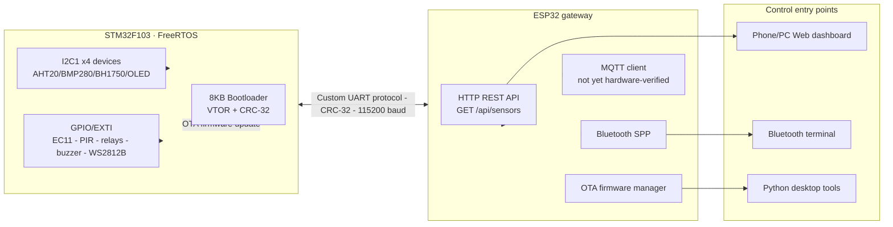

<div align="center">

# STM32 Smart-Home OTA System
### Environmental Monitoring & Linkage Control System

**STM32F103 + FreeRTOS + ESP32** | Custom Bootloader | Wi-Fi / Bluetooth OTA | Hardware-verified end to end

[](README.md)
[](README_EN.md)

[](https://github.com/finnyoun9/stm32-smart-home-ota/actions/workflows/firmware.yml)


<sub>Breadboard development stage · not the final assembled state · a final hardware photo will be added later</sub>

</div>

> **Repository rename (2026-08-17):** `bluepill-ota-bootloader` → `stm32-smart-home-ota`. The old name only described the bootloader; the new name reflects the full system: FreeRTOS, sensors/actuators, an ESP32 gateway, and OTA. The old GitHub link redirects automatically.

## Navigation

[Why this project](#why-this-project) · [Status](#status) · [System architecture](#system-architecture) · [Tech stack](#tech-stack) · [Hardware photos](#hardware-photos) · [Getting started](#getting-started) · [Biggest technical challenge](#biggest-technical-challenge) · [AI-assisted development](#ai-assisted-development) · [Documentation index](#documentation-index)

## Why this project

My background is Web/backend (Node/TS). This project was deliberately designed as proof-of-capability while switching toward STM32/MCU embedded roles — the scope was reverse-engineered from the skills that show up repeatedly in embedded job postings: writing a bootloader from scratch, FreeRTOS task partitioning, a wireless gateway (ESP32), a custom communication protocol with real hardware OTA, multi-sensor/actuator integration, and hardware/software bring-up debugging. It's not a tutorial clone spun up to look busy. The full portfolio plan lives in [docs/resume-roadmap.md](docs/resume-roadmap.md): a second project (an STM32F407VET6 minimum system board) covers the schematic/PCB/soldering/bring-up side of hardware design, so together the two projects span "firmware system integration" and "hardware design through physical verification."

## Status

| Subsystem | Status | Evidence boundary |
| --- | --- | --- |
| 8 KB custom bootloader + VTOR relocation + CRC-32 | **Hardware-verified** | Application boots correctly from `0x08002000` |
| Bluetooth / phone Web OTA (dual entry points) | **Hardware-verified** | Automated via `tools/ota_regression.py`: Bluetooth path PASS at `VERSION=3`, Web path PASS at `VERSION=4` |
| FreeRTOS, 4-task architecture (comm/control/app/monitor) | **Hardware-verified** | The dedicated status-LED task (PC13 heartbeat) was removed; its logic folded into existing tasks |
| Multi-sensor (AHT20/BMP280/BH1750/SSD1306/HC-SR501) | **Hardware-verified** | All 4 I2C1 addresses stable on real hardware; OLED menu is fully navigable |
| Two relay channels + active buzzer | **Hardware-verified** | PA2/PA3/PB1, controllable from both Bluetooth and Web |
| WS2812B auto-dimming | **Hardware-verified** | Logic-analyzer DOUT evidence — see [Biggest technical challenge](#biggest-technical-challenge) |
| ESP32 Web dashboard + `GET /api/sensors` | **Hardware-verified** | 1-second refresh, 18-byte fixed-point snapshot |
| Firmware CI (GitHub Actions) | **Green** | Builds all three firmware targets and runs the protocol smoke test automatically |
| MQTT (public EMQX sandbox broker) | **Code complete, not yet hardware-verified** | Compiles cleanly; publish/subscribe not yet confirmed against real hardware |
| ST7789 TFT new menu / bilingual UI | **Not yet hardware-verified** | Builds cleanly; full regression not yet complete |

The full verified/planned record lives in [CHANGELOG.md](CHANGELOG.md); the job-search wrap-up plan is in [docs/resume-roadmap.md](docs/resume-roadmap.md). `WebSocket` and several planned sensors (MPU6050/VL53L0X/DHT11/MQ-2/HC-SR04) remain target architecture and **are not completed capabilities**.


## System architecture



## Tech stack

### STM32 (C, FreeRTOS)

- **Bootloader**: 8KB bare-metal, Flash partition management, `.ramfunc` RAM execution, CRC-32 verification, OTA state machine
- **FreeRTOS**: currently a 4-task architecture (Comm/Control/App/Monitor); `AppTask` integrates local sensor sampling, PIR state, and the OLED menu
- **Current peripherals**:
  - I2C1 100kHz multi-device bus: SSD1306, BH1750, AHT20, BMP280
  - GPIO/EXTI: EC11 four-state decoding, a dedicated confirm button, HC-SR501 input
  - GPIO output: two active-low relays on PA2/PA3, an active-low buzzer on PB1, WS2812B bit-banged output on PB5
- **Planned peripherals**:
  - I2C2 (MPU6050, VL53L0X)
  - UART (dual serial: ESP32 protocol + debug logging)
  - 1-Wire (DHT11 bit-banging)
  - Timer Encoder Mode (hardware quadrature decoding for the rotary encoder)
  - Timer Input Capture (HC-SR04 ultrasonic ranging)
  - PWM 50Hz (SG90 servo angle control)
  - ADC (MQ-2 smoke concentration sensing)
  - GPIO external interrupts (PIR motion detection + beam-break door/window sensing)

### ESP32 (C++, ESP-IDF)

- Bluetooth Classic SPP server (direct phone control)
- WiFi SoftAP + phone-driven Web OTA (hardware-verified)
- STM32 sensor-snapshot polling + a cached `GET /api/sensors` endpoint (hardware-verified)
- WiFi HTTP client (remote OTA firmware download)
- SPIFFS firmware staging + Application vector-table/CRC verification
- MQTT client (public EMQX sandbox broker; code merged, not yet hardware-verified)
- WebSocket (planned)

### Control interfaces

- **Phone Web OTA**: a responsive page built into the ESP32; an iPhone can upload a `.bin` directly
- **Web dashboard**: a plain HTML/CSS/JS SPA served by the ESP32; live state is wired up, write control and historical charts are still to come
- **Bluetooth terminal**: Windows/Android Classic SPP text commands (iPhone doesn't support SPP)
- **Python desktop**: `ota_sender.py` for firmware upload, `control_panel.py` for a control panel, and `ota_regression.py` for automated OTA regression

## Sensor progress

| Module | Current interface | Function | Address/pin | Status |
|------|----------|------|-----------|------|
| AHT20 + BMP280 combo board | I2C1 | Temperature, humidity, pressure | 0x38 + 0x76/0x77 | Hardware-verified |
| BH1750 | I2C1 | Ambient light | 0x23 | Hardware-verified |
| SSD1306 OLED | I2C1 | Always-on environment/actuator status | 0x3C | Hardware-verified |
| GMT020-02 TFT | SPI2 | 240x320 color menu and control page | ST7789V | New UI, not yet hardware-verified |
| 15x WS2812B | GPIO bit-bang | BH1750-driven inverse white-light brightness | PB5 | Hardware-verified (DOUT confirmed) |
| HC-SR501 | GPIO | PIR motion sensing | PB0 | Hardware-verified |
| EC11 + back button | GPIO EXTI + GPIO | Rotary select, PA1 confirm, PA4 back | PA6/PA7 + PA1/PA4 | Back button wiring not yet verified |
| MPU6050 | I2C2 (planned) | 6-axis attitude | 0x68 | Not yet integrated |
| VL53L0X | I2C2 (planned) | Laser ranging | 0x29 | Not yet integrated |
| DHT11 | 1-Wire (planned) | Redundant temperature/humidity | - | Not yet integrated |
| MQ-2 | ADC (planned) | Smoke concentration | - | Not yet integrated |
| HC-SR04 | Timer IC (planned) | Ultrasonic ranging | - | Not yet integrated |

## Planned actuator list

| Module | Control method | Linkage scenario | Status |
|------|---------|---------|------|
| 2x relay | GPIO OUT | Relay 2 = light strip (NO2 switches VCC); relay 1 currently unused | Hardware-verified |
| Ultrasonic mist maker | GPIO OUT | Paused | Driver board damaged, pending replacement |
| SG90 servo | PWM 50Hz | Blind/valve angle | Not yet integrated |
| Active buzzer | GPIO OUT | Manual control now; smoke/high-temp linkage planned | Hardware-verified |

## Flash memory layout

| Region | Address | Size | Notes |
|------|------|------|------|
| Bootloader | 0x08000000 | 8KB | OTA state machine + Flash programming |
| Application | 0x08002000 | 54KB | FreeRTOS + sensors + control |
| Config | 0x0800F800 | 2KB | OTA state + firmware version |

## Hardware wiring

The full pin assignment and breadboard wiring diagram are in [docs/project-framework.md](docs/project-framework.md).

```
STM32 Blue Pill          ESP32              Sensors/Actuators
─────────────────        ────────────        ────────────
PA9 (TX)  ────────────► GPIO16 (RX)
PA10 (RX) ◄──────────── GPIO17 (TX)
GND       ─────────────── GND

PB6/PB7  (I2C1 SCL/SDA) ─── AHT20+BMP280 + BH1750 + SSD1306
PB13/PB15 (SPI2 SCK/MOSI) ── GMT020-02 SCL/SDA
PB12/PB14/PA8 (GPIO OUT) ─── GMT020-02 CS/DC/RST
PB5      (GPIO bit-bang) ───── WS2812B DIN
PA6/PA7  (GPIO EXTI) ─────── EC11 A/B
PA1      (GPIO IN) ───────── EC11 confirm button
PB0      (GPIO IN) ───────── HC-SR501 PIR
PB10/PB11 (I2C2, planned) ── MPU6050 + VL53L0X
PA2      (GPIO OUT) ──────── Relay 1 (unused, active-low)
PA3      (GPIO OUT) ──────── Relay 2 (NO2 -> light strip VCC, active-low)
PB1      (GPIO OUT) ──────── Active buzzer (active-low)
PA0      (TIM2_CH1) ──────── SG90 servo
PA5      (ADC) ───────────── MQ-2 smoke (via 1k/2k divider)
```

### Hardware photos

<details>
<summary><strong>Expand breadboard development photos</strong></summary>

| Early build (ESP32 + STM32 + EC11 + BH1750 + OLED) | Early build (with PIR + logic-analyzer wiring) |
| --- | --- |
|  |  |

| Full wiring (with ST7789 TFT) | OLED garbled-Chinese fix, before/after |
| --- | --- |
|  |  |

All of the above are in-progress wiring states, **not the final build**; a photo of the finished assembly will be added here once complete. Full notes in [docs/photos/README.md](docs/photos/README.md).

</details>

## Getting started

### Toolchain

```bash
pip install pyserial        # Python tools
pio --version               # PlatformIO (builds both STM32 targets + ESP32)
```

### Build

```bash
pio run -e bluepill                # Bootloader -> .pio/build/bluepill/firmware.bin
pio run -e app                     # Application -> .pio/build/app/firmware.bin
pio run -d esp32-comm-bridge       # ESP32 bridge -> esp32-comm-bridge/.pio/build/esp32dev/firmware.bin
```

### Flash

1. **Bootloader**: via ST-Link, run `pio run -e bluepill -t upload`, writes to `0x08000000`
2. **Application**: via ST-Link, run `pio run -e app -t upload`, writes to `0x08002000`
3. **ESP32**: manually enter download mode, then run `pio run -d esp32-comm-bridge -t upload --upload-port COM4`

### Test

```bash
# Windows Bluetooth SPP outgoing port (currently COM6 on this machine)
pio device monitor -p COM6 -b 115200

# Type STATUS or VERSION in the monitor and press Enter

# Automated OTA regression (both Bluetooth and Web paths, with version readback)
py -3.11 tools/ota_regression.py bluetooth --port COM6
py -3.11 tools/ota_regression.py web --base-url http://192.168.4.1 --verify-port COM6

# Phone Web OTA: connect to the ESP32 hotspot, then visit
# SSID: STM32-OTA-Bridge / Password: stm32ota
open http://192.168.4.1 in a browser

# Check the STM32's realtime sensor/actuator snapshot
curl.exe http://192.168.4.1/api/sensors
```

<details>
<summary><strong>Expand full phone Web OTA flow</strong></summary>

1. Connect the phone to the ESP32 hotspot `STM32-OTA-Bridge`, password `stm32ota`
2. Open `http://192.168.4.1` in Safari/browser
3. Select the STM32 Application's `firmware.bin` and enter a target version greater than 0
4. Tap "Start OTA Update" and wait for the page to report success

The home page polls `GET /api/sensors` every second, showing temperature/humidity, pressure, light, PIR, both relays, the buzzer, auto mode, and light-strip brightness. The ESP32 queries the STM32's 18-byte fixed-point snapshot over UART once per second; the page reports a data timeout once the cache is more than 5 seconds stale. Full implementation in [docs/web-realtime-dashboard.md](docs/web-realtime-dashboard.md).

The OTA page uploads via `POST /api/upload?version=<N>`. The ESP32 checks the 54KB size ceiling, CRC-32, the Cortex-M initial stack pointer, and the Application reset vector; once verified, `POST /api/start` kicks off the UART OTA. `GET /api/status` reports upload/write progress.

> Web OTA only accepts an Application image linked to `0x08002000`. A `.bin` built for the bootloader or another target is rejected by the vector-table check.

</details>

<details>
<summary><strong>Expand Bluetooth command reference</strong></summary>

Connect to the ESP32's Bluetooth SPP service `STM32-OTA-Bridge` (use "Serial Bluetooth Terminal" on a phone):

| Command | Description |
|------|------|
| `STATUS` | Bridge status: BT/WiFi connection, firmware staging state |
| `VERSION` | Query the STM32's current firmware version |
| `OTA <url>` | Download firmware from a URL and trigger OTA (version parsed from the `fw_v<N>.bin` filename) |
| `FW <ver>,<size>,<crc32>` | Start a Bluetooth firmware push; declares exact length, version, and standard CRC-32 |
| `DATA <offset>,<base64>` | Write one Base64-encoded firmware chunk; the ESP32 ACKs with the next offset (normally sent automatically by the script) |
| `VERIFY` | Verify the staged file's length and CRC-32 (normally sent automatically by the script) |
| `SEND` | After the bridge replies `FW: staged`, transfer the verified staged firmware to the STM32 |
| `WIFI <ssid>,<pass>` | Configure WiFi and reconnect (persisted to NVS, survives reboot) |
| `RESET` | Software-reset the ESP32 |
| `RELAY1 ON/OFF` | Control relay 1 (currently no load attached) |
| `RELAY2 ON/OFF` | Control relay 2 (switches the light-strip VCC via NO2) |
| `RELAY` | Query both relay states and auto mode |
| `AUTO ON/OFF` | Stays off while the humidifier is removed; command kept for compatibility |
| `MANUAL` | Disable auto linkage (equivalent to `AUTO OFF`) |
| `BUZZER ON/OFF` | Control the active-low buzzer on PB1 |

> The Web control page already wires up `POST /api/control`. It currently controls the light-strip power (Relay 2 / NO2) and the buzzer; brightness is still auto-mapped from BH1750, and the web brightness slider isn't wired up yet.
>
> The mist-maker driver board was damaged once by powering it on without a load attached; the humidifier has been removed from both the firmware's auto linkage and the Web control until a replacement module is wired up and confirmed to require a load before power-on.
>
> `tools/bridge_ota.py` automatically computes `<size>` and CRC, encodes the firmware as offset-acknowledged Base64 chunks, and sends `VERIFY` before `SEND`. Don't paste a raw `.bin` into a plain serial terminal by hand.

</details>

## Biggest technical challenge

**Primary challenge: bringing up the WS2812B light strip.** The initial approach generated WS2812B timing with SPI1 at 4MHz using 5-bit encoding. The waveform measured at `DIN` with a logic analyzer — pulse widths, bit count — looked completely correct, but the strip did nothing. Trusting "the sender looks right" would have kept this bug unsolved indefinitely; the real evidence has to come from the next stage of the chain. Moving the probe to the first LED's `DOUT` showed no forwarded signal at all — the LED wasn't correctly decoding the timing SPI produced (the SPI clock domain didn't match the WS2812B single-wire timing protocol at the edge cases). Switching to hand-written GPIO bit-banging at the 64MHz core clock finally got `DOUT` to capture a valid 336-bit / 42-byte frame for the remaining 14 LEDs — only then was the chain actually closed. That lesson turned into a standing debugging habit: never trust "the sender looks right," only trust evidence from the receiver or the next stage downstream — the "hardware-verified vs. planned" evidence-boundary rule that runs through this README and CHANGELOG.md grew directly out of this incident. The comparison evidence is kept under [docs/captures/](docs/captures/README.md): `spi-din-not-accepted.vcd` (the old SPI approach's DIN input) and `bitbang-dout-confirmed.vcd` (the final bit-bang approach's DOUT output).

**Secondary challenge (a better story for architecture trade-off discussions):** the STM32F103 has only 64KB of single-bank Flash, split into an 8KB bootloader and a 54KB application with no room reserved for an A/B partition scheme. That means an OTA transfer interrupted by a power loss immediately invalidates the old firmware — the bootloader erases page 0 of the application region (including the interrupt vector table) as soon as it receives the first chunk (details under "Known limitations" below). This is a real trade-off forced by chip selection and the Flash budget; in an interview it's better to explain it directly as a resource-constrained engineering decision than to dodge the question.

## AI-assisted development

This project was built end to end in collaboration with Claude Code / Codex, with the boundaries stated plainly — neither overstated nor hidden:

- **Code generation and refactoring**: large first drafts of the STM32 driver skeletons, the custom UART protocol parser, the ESP32 REST API, and the Web dashboard frontend (HTML/CSS/JS) were AI-generated; I adapted them to match the actual pins/timing and verified everything on hardware.
- **Debugging assistance**: I fed logic-analyzer waveform descriptions, serial logs, and failure symptoms to the AI and had it enumerate possible causes (for example, the several possible reasons the first WS2812B LED's `DOUT` produced nothing, or how to track down the 4 wrong constants in the CRC lookup table). I ruled hypotheses in or out on real hardware one at a time — the AI narrowed the search space; it didn't get to decide the conclusion.
- **Engineering documentation and project management**: the "hardware-verified vs. planned" evidence-separation discipline running through [docs/agent-handoff.md](docs/agent-handoff.md), [docs/resume-roadmap.md](docs/resume-roadmap.md), and [CHANGELOG.md](CHANGELOG.md) was drafted and maintained primarily by the AI — effectively treating it as a standing technical project manager that tracks the baseline, lists P0 items, and reviews acceptance criteria, while I reviewed and made the final calls.
- **What didn't change**: every bit of hardware wiring, powering-on, oscilloscope/logic-analyzer measurement, and every "hardware-verified" conclusion was done and confirmed by me on real hardware. AI doesn't get to judge real hardware behavior for you — that's also why this repository is strict about separating "AI-generated/suggested" from "hardware-verified."

<details>
<summary><strong>Expand directory structure</strong></summary>

```
stm32-smart-home-ota/
├── shared/                  # Shared protocol (CRC-32/framing/config)
├── bootloader/              # 8KB custom bootloader
├── application/             # STM32 FreeRTOS application
├── esp32-comm-bridge/       # ESP32 communication gateway
├── tools/                   # Python PC tools (includes automated OTA regression)
└── docs/                    # Architecture + wiring + API + photos + capture evidence
```

Full details in [docs/project-framework.md](docs/project-framework.md).

</details>

<details>
<summary><strong>Expand development log (chronological)</strong></summary>

### Local verification record (2026-08-07)

- The bootloader builds and verifies via PlatformIO's `ststm32` platform: RAM 11.0% (2252B), Flash 8.8% (5756B), `firmware.bin` around 6KB (within the bootloader's 8KB hard constraint).
- Fixed: the `BootConfig_t` size assertion in `shared/protocol.h` (56 -> 48 bytes, matching the actual 12 x uint32 = 48B), and guarded `FLASH_BASE`/`FLASH_PAGE_SIZE` with `#ifndef` to avoid redefinition conflicts with the STM32 HAL.
- PC-side tool: `python tools/ota_sender.py COM3 fw.bin --version 2` (Windows serial ports use the COM format).
- Note: building the ESP32 target requires PlatformIO to reach the official package mirrors (a mirror is recommended on networks in mainland China).

### Local verification record (2026-08-08)

**All three firmware targets build** (PlatformIO + ststm32 / espressif32):

| Firmware | RAM | Flash | Artifact |
|------|-----|-------|------|
| Bootloader | 11.0% (2252B) | 8.8% (5756B) | `.pio/build/bluepill/firmware.bin` |
| Application | 87.4% (17900B) | 50.6% (33192B) | `.pio/build/app/firmware.bin` |
| ESP32 Bridge | 19.9% (65184B) | 74.8% (1372089B / 1835008B) | `esp32-comm-bridge/.pio/build/esp32dev/firmware.bin` |

Key findings (details in [docs/build-notes.md](docs/build-notes.md)):
- **ESP-IDF 6 API migration**: `esp_spp_init` -> `esp_spp_enhanced_init(&cfg)`; `esp_bt_dev_set_device_name` -> `esp_bt_gap_set_device_name`; `esp_wifi_is_connected` -> `esp_wifi_sta_get_ap_info()`.
- **The real ESP32 hardware has 4MB of Flash**: confirmed 2026-08-12 via `esptool flash_id` reading JEDEC ID `c4:6016`; the factory partition stays at 1.75MB with SPIFFS storage expanded to 2.19MB.
- **Light-strip control**: the TFT and Web share STM32 state, both supporting Relay 2 / NO2 power switching, AUTO/MANUAL mode, and manual brightness (1-100%). AUTO still maps BH1750's 5-1000 lux range.
- **TFT bilingual UI**: toggled from the system page by pressing the encoder, or from the Web system page. Chinese text uses a trimmed 16x16 glyph subset; the setting currently only persists for the current power cycle to avoid frequent Flash writes on a single-bank chip just for a UI preference.
- **The Bluetooth component is enabled via `sdkconfig.defaults`** (the `-D CONFIG_BT_*` compiler macros don't work for ESP-IDF).
- **The shared protocol is cross-platform**: `shared/protocol.c` is C/C++ compatible; the ESP32 side compiles a mirrored `src/protocol.cpp`.
- **Building the ESP32 target on networks in mainland China needs a proxy**: `$env:HTTPS_PROXY='http://127.0.0.1:7897'; pio run -d esp32-comm-bridge`.
- The application runs on an 8MHz HSE -> PLL x8 64MHz clock; initial bring-up used 9600 baud, and the STM32<->ESP32 link is now unified at 115200 baud.

### Hardware OTA closed-loop verification (2026-08-09)

- Both the ESP32 (CH340, COM4) and STM32 (ST-Link SWD) were flashed and passed a post-write verification.
- Physical UART: `ESP32 GPIO17 -> PA10`, `ESP32 GPIO16 <- PA9`, both boards' grounds tied together; USART1 at 9600 baud.
- Windows connected via Bluetooth Classic SPP on COM6 to `STM32-OTA-Bridge`; the basic link sent `VERSION` 10 times in a row with 10/10 successes.
- Used `tools/bridge_ota.py` to stage and send a 15,956-byte application image with CRC-32 `0x3B274D7E`; the ESP32 replied `STATUS: OTA complete!`.
- A follow-up `VERSION` query after OTA returned `FW Version: 1`. This run covered the full PC -> Bluetooth SPP -> ESP32 SPIFFS -> STM32 bootloader -> Flash/CRC -> application-boot path.
- The investigation turned up 4 wrong constants across two CRC lookup tables; the classic `123456789` test vector happened not to trigger them. A full-byte `0x00..0xFF` vector (expected `0x29058C73`) was added as a regression to catch similar issues that a single test vector could miss.
- An iPhone connected to the ESP32's SoftAP and opened the built-in Web OTA page; it uploaded the 15,956-byte application image with target version 2, and a follow-up query over COM6 returned `FW Version: 2` — this path needs no PC, ST-Link, or ESP32 USB involvement to send firmware.

### Local environment terminal verification (2026-08-10)

- SSD1306, BH1750, and the AHT20+BMP280 combo board all share I2C1 on `PB6/PB7 @ 100kHz`; all four addresses are stable on real hardware.
- The OLED menu supports rotary selection, button confirmation, and back navigation across pages for environment, light, motion, system status, and project info.
- AHT20/BMP280 display temperature, relative humidity, and pressure; humidity uses fixed-point math and displays as `61.0% RH`, with no software floating point involved.
- The HC-SR501 has a 30-second warm-up state and HIGH/LOW detection; BH1750 light readings refresh periodically.
- Application build footprint: RAM 17,676 B (86.3%), Flash 25,200 B (38.5%); RAM headroom needs attention for further expansion.

### Actuator and WS2812B bring-up verification (2026-08-11)

- The two active-low relays moved to `PA2/PA3`, and the active buzzer is on `PB1`; power, common ground, manual commands, and relay contact action were all confirmed on hardware.
- The WS2812B strip is powered from a DP100 5V supply stepped down to about 4.2V through a 1N4001 diode, with the data line on `PB5 -> DIN` and a shared ground with the STM32. A series 220-470 ohm resistor on the data line is still recommended, though it wasn't the cause of this particular failure.
- The original SPI1 4MHz/5-bit encoding measured reasonable pulse widths and data at `DIN`, but the first LED's `DOUT` produced nothing, so the strip never actually received data. Switching back to the hardware-verified 64MHz GPIO bit-bang driver got `DOUT` to capture a valid 336-bit / 42-byte frame across the remaining 14 LEDs, closing the loop for real.
- Final logic: BH1750 updates a target brightness every 200ms, mapping `<=5 lux -> 160/255` and `>=1000 lux -> 1/255` with an inverse linear curve in between; each update steps by at most 16 levels, changes within 2 levels are treated as sensor jitter, and a light-strip frame is only sent when brightness actually changes.
- Current application build footprint: RAM 17,900 B (87.4%), Flash 33,192 B (50.6%). The OLED is now an always-on status screen, and the TFT uses a partial-refresh menu with no framebuffer. Full waveform evidence and debugging conclusions are in [docs/build-notes.md](docs/build-notes.md).

### Automated OTA regression and PC13 heartbeat removal (2026-08-23 / 2026-08-24)

- Added `tools/ota_regression.py`: automates firmware baseline recording plus sending and version-readback verification for both the Bluetooth and Web OTA paths, writing results to [docs/ota-regression-final.md](docs/ota-regression-final.md). The Bluetooth path passed at `VERSION=3`, the Web path at `VERSION=4`.
- Removed the standalone status-LED heartbeat task (`PC13`); FreeRTOS went from 5 tasks down to 4, no longer dedicating a task stack just to a heartbeat indicator.
- Added a `Firmware CI` GitHub Actions workflow: builds all three firmware targets and runs the shared protocol smoke test automatically on every push.

</details>

## Key constraints

- STM32F103 has a single Flash bank -> Flash-programming code must execute from RAM (`.ramfunc`)
- Flash page size is 1KB -> OTA transfers in 1KB chunks
- The bootloader is fixed at 8KB -> it cannot grow beyond that
- The Application starts at `0x08002000` -> `SCB->VTOR` must be set accordingly

### Known limitation: no rollback if power is lost mid-OTA

The bootloader erases page 0 of the application region (including the interrupt vector table) as soon as it receives the first chunk, so a power loss mid-OTA immediately invalidates the old firmware: on the next boot, `app_is_valid()` reports the application as invalid and the device sits in the bootloader's maintenance mode, requiring either a fresh OTA or a re-flash via ST-Link to recover. This is a direct consequence of the 64KB single-bank Flash with no room reserved for an A/B partition — a production-grade design would typically write to a staging area and switch atomically only after full verification, but that isn't possible within the 8KB bootloader + 54KB application budget here. Keep the power supply stable during OTA and avoid disconnecting mid-transfer.

## Documentation index

| Document | Contents |
| --- | --- |
| [CHANGELOG.md](CHANGELOG.md) | Bilingual development changelog, strictly separating "hardware-verified" from "planned" |
| [docs/resume-roadmap.md](docs/resume-roadmap.md) | Job-search wrap-up plan, resume-copy drafts, and the two-project portfolio positioning |
| [docs/agent-handoff.md](docs/agent-handoff.md) | Agent handoff baseline, P0 tasks, and hardware-acceptance red lines |
| [docs/project-framework.md](docs/project-framework.md) | Full pin assignment, breadboard wiring diagram, and directory notes |
| [docs/build-notes.md](docs/build-notes.md) | Build and hardware-debugging details, including the full WS2812B DIN/DOUT investigation |
| [docs/web-realtime-dashboard.md](docs/web-realtime-dashboard.md) | Full implementation of the Web dashboard and `/api/sensors` |
| [docs/ota-regression-final.md](docs/ota-regression-final.md) | Firmware baseline and hardware results for the automated OTA regression |
| [docs/photos/README.md](docs/photos/README.md) | Breadboard photo notes |
| [docs/captures/README.md](docs/captures/README.md) | Logic-analyzer capture evidence (UART, WS2812B DIN/DOUT) |

## License

MIT
